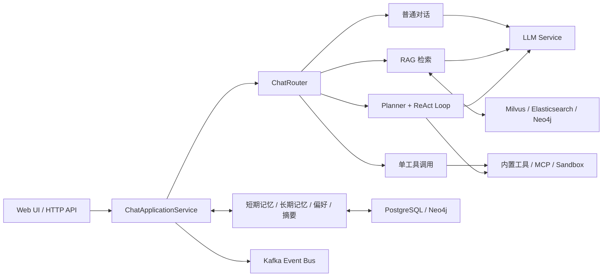

# Office Agent

一个基于 Java 17 与 Spring Boot 3 的办公智能体项目。它把多轮对话、RAG 知识库、四层记忆、工具调用、ReAct 多步执行、知识图谱和离线评测整合到同一个 Web 应用中，并提供开箱即用的单页界面与 HTTP API。

## 主要能力

- **统一对话入口**：自动在普通对话、RAG、单工具和 ReAct 多工具模式之间路由。
- **流式执行**：通过 SSE 逐步返回规划、工具调用、观察结果和最终答案，并支持取消任务。
- **混合 RAG**：组合 Milvus 向量检索、Elasticsearch 关键词检索和 Neo4j 图检索，使用加权 RRF 融合；支持 Query Rewrite、小块召回/大块生成和可选 LLM Rerank。
- **文档知识库**：支持直接写入文本，以及上传 PDF、TXT、Markdown 文件；文档可同步进入 RAG 索引。
- **分层记忆**：按 `user_id` 与 `session_id` 隔离短期记忆、长期记忆、用户偏好和会话摘要。
- **工具系统**：内置时间、模拟天气、Web 搜索、知识库检索和沙箱命令工具，并可在运行时注册 HTTP MCP 工具。
- **可靠执行**：包含执行计划、步骤重试、超时、快照和中断机制。
- **RAG 离线评测**：支持版本化黄金数据集，以及 Recall、MRR、NDCG、上下文质量和生成质量评测。
- **可选基础设施**：PostgreSQL、Milvus、Elasticsearch、Neo4j 和 Kafka 不可用时，应用会尽量降级运行。

## 系统架构



一次请求的核心链路是：上下文组装 → 模式路由 → 检索或工具执行 → LLM 生成 → 记忆写入与快照保存。外部组件由基础设施层统一连接，连接失败不会阻止应用进入基础模式。

## 技术栈

| 类别 | 技术 |
| --- | --- |
| 后端 | Java 17、Spring Boot 3.2、Maven |
| 前端 | 原生 HTML / CSS / JavaScript |
| 模型接口 | 火山引擎 Ark 兼容的 Chat Completions 与 Embeddings API |
| 数据持久化 | PostgreSQL 16 |
| 检索 | Milvus、Elasticsearch、Neo4j、加权 RRF |
| 事件 | Kafka（KRaft） |
| 文档解析 | Apache PDFBox |
| 测试 | JUnit 5、Spring Boot Test |

## 快速开始

### 环境要求

- JDK 17
- Maven 3.8+
- Docker Desktop 或 Docker Engine（仅完整基础设施、容器部署和 Docker 沙箱需要）

### 1. 最小模式启动

不配置 API Key，也不启动外部基础设施，即可体验页面、接口、Mock 对话和内存能力。

```bash
mvn spring-boot:run
```

打开 <http://localhost:8090>，或检查运行状态：

```bash
curl http://localhost:8090/api/status
```

### 2. 接入真实模型

项目默认使用火山引擎 Ark 地址。推荐通过环境变量传入密钥，不要把密钥提交到仓库。

PowerShell：

```powershell
$env:APP_LLM_API_KEY = "your-ark-api-key"
$env:APP_EMBEDDING_API_KEY = "your-ark-api-key"
$env:TAVILY_API_KEY = "your-tavily-api-key" # 可选
mvn spring-boot:run
```

Bash：

```bash
export APP_LLM_API_KEY="your-ark-api-key"
export APP_EMBEDDING_API_KEY="your-ark-api-key"
export TAVILY_API_KEY="your-tavily-api-key" # 可选
mvn spring-boot:run
```

如需使用其他兼容服务，可同时覆盖：

```text
APP_LLM_API_URL
APP_LLM_MODEL
APP_EMBEDDING_API_URL
APP_EMBEDDING_MODEL
```

只配置 LLM Key 时可以真实对话；未配置 Embedding Key 时，向量相关能力会回退到非向量或内存路径。

### 3. 启动完整基础设施

先启动 PostgreSQL、Milvus、Elasticsearch、Kafka 和 Neo4j，再在宿主机运行应用：

```bash
docker compose up -d milvus postgres elasticsearch kafka neo4j
mvn spring-boot:run
```

`milvus` 会自动带起其依赖的 etcd 和 MinIO。首次拉取镜像和等待健康检查需要一些时间。

也可以构建并启动包含应用在内的全部服务：

```bash
docker compose up -d --build
```

容器模式需要在 `docker-compose.yml` 的 `agi-agent.environment` 中额外传入 `APP_LLM_API_KEY`、`APP_EMBEDDING_API_KEY` 和可选的 `TAVILY_API_KEY`，否则应用会使用 Mock 模式。

## 配置说明

主配置文件位于 `src/main/resources/application.yml`，Spring Boot 配置均可用同名环境变量覆盖。例如 `app.rag.top-k` 对应 `APP_RAG_TOP_K`。

| 配置 | 默认值 | 说明 |
| --- | --- | --- |
| `server.port` | `8090` | HTTP 服务端口 |
| `app.llm.api-key` | 空 | 为空时使用 Mock LLM |
| `app.embedding.api-key` | 空 | 为空时不调用真实 Embedding API |
| `app.rag.top-k` | `3` | 最终检索结果数量 |
| `app.rag.enable-hybrid-search` | `true` | 是否启用混合检索 |
| `app.rag.rewrite.enabled` | `true` | 是否启用查询改写 |
| `app.rag.rerank.enabled` | `false` | 是否启用 LLM 精排 |
| `app.memory.short-term-max-turns` | `10` | 短期记忆最大轮数 |
| `app.harness.max-iterations` | `5` | ReAct 最大迭代数 |
| `app.sandbox.backend` | `docker` | `docker`、`local` 或 `mock` |
| `app.neo4j.enabled` | `true` | 是否尝试启用知识图谱 |

外部服务的默认开发端口：

| 服务 | 地址/端口 |
| --- | --- |
| Web 应用 | `http://localhost:8090` |
| PostgreSQL | `localhost:5432` |
| Milvus | `localhost:19530` |
| Elasticsearch | `http://localhost:9200` |
| Kafka | `localhost:29092` |
| Neo4j Browser / Bolt | `http://localhost:7474` / `bolt://localhost:7687` |
| MinIO Console | `http://localhost:9001` |

## API 示例

### 同步对话

```bash
curl -X POST http://localhost:8090/api/chat \
  -H "Content-Type: application/json" \
  -d '{
    "message": "总结一下我的知识库里关于报销制度的内容",
    "use_rag": true,
    "selected_tools": [],
    "user_id": "demo-user",
    "session_id": "demo-session"
  }'
```

请求字段：

| 字段 | 必填 | 说明 |
| --- | --- | --- |
| `message` | 是 | 用户输入 |
| `use_rag` | 否 | 是否启用知识库检索，默认 `false` |
| `selected_tools` | 否 | 指定允许使用的工具名称；多工具可进入 ReAct 流程 |
| `explicit` | 否 | 是否按显式工具选择处理 |
| `user_id` | 否 | 用户记忆空间标识 |
| `session_id` | 否 | 会话短期记忆标识 |

### 流式对话与取消

流式接口为 `POST /api/chat/stream`，请求体与同步接口一致，响应类型为 `text/event-stream`。

```bash
curl -N -X POST http://localhost:8090/api/chat/stream \
  -H "Content-Type: application/json" \
  -d '{"message":"查询资料并给出执行计划","selected_tools":["search_web"]}'
```

取消当前执行任务：

```bash
curl -X POST http://localhost:8090/api/chat/cancel
```

### 导入知识库

直接导入文本：

```bash
curl -X POST http://localhost:8090/api/upload \
  -H "Content-Type: application/json" \
  -d '{"content":"这里是要进入知识库的文档内容。"}'
```

上传 PDF、TXT 或 Markdown 文件：

```bash
curl -X POST http://localhost:8090/api/upload/file \
  -F "file=@./example.pdf"
```

扫描版 PDF 当前不包含 OCR 引擎；接口会返回 `needs_ocr: true`，需要先在外部完成 OCR。

### 常用接口

| 方法 | 路径 | 用途 |
| --- | --- | --- |
| `POST` | `/api/chat` | 同步对话 |
| `POST` | `/api/chat/stream` | SSE 流式对话 |
| `POST` | `/api/chat/cancel` | 取消当前任务 |
| `POST` | `/api/upload` | 导入纯文本到 RAG |
| `POST` | `/api/upload/file` | 上传 PDF/TXT/Markdown |
| `GET` | `/api/documents` | 查询文档列表 |
| `GET` | `/api/documents/{id}` | 查询文档与最新版本 |
| `POST` | `/api/documents` | 创建文档，可选择写入 RAG |
| `POST` | `/api/docs/delete` | 按 `doc_hash` 删除 RAG 文档块 |
| `GET` | `/api/memory` | 查询用户/会话记忆状态 |
| `GET` | `/api/tools` | 查询可用工具 |
| `POST` | `/api/tools/mcp` | 动态注册 HTTP MCP 工具 |
| `GET` | `/api/snapshots` | 查询执行快照 |
| `GET` | `/api/status` | 查询应用与基础设施状态 |

## RAG 离线评测

评测数据使用父级 Context ID 作为黄金标签。先读取可标注上下文：

```bash
curl http://localhost:8090/api/rag/evaluations/contexts
```

保存一个版本化数据集：

```bash
curl -X POST http://localhost:8090/api/rag/evaluations/datasets \
  -H "Content-Type: application/json" \
  -d '{
    "name": "office-policy",
    "version": "v1",
    "description": "办公制度基准集",
    "cases": [{
      "caseId": "expense-001",
      "question": "上海出差住宿报销上限是多少？",
      "referenceAnswer": "上海属于一类地区，住宿费上限为每人每天 600 元。",
      "relevantContextIds": [101, 102],
      "category": "差旅",
      "difficulty": "normal"
    }]
  }'
```

运行评测：

```bash
curl -X POST http://localhost:8090/api/rag/evaluations/runs \
  -H "Content-Type: application/json" \
  -d '{
    "datasetName": "office-policy",
    "datasetVersion": "v1",
    "topKs": [1, 3, 5, 10],
    "generationEvaluation": true
  }'
```

可通过 `GET /api/rag/evaluations/runs/{runId}` 获取报告，或通过 `GET /api/rag/evaluations/runs` 查询历史。没有真实 LLM 时，依赖模型裁判的生成指标会跳过；没有 PostgreSQL 时，数据仅保留在当前进程内存中。

## 项目结构

```text
src/main/java/com/jianjin/assistant/
├── application/chat/       # 对话编排、路由、ReAct、上下文与子智能体
├── config/                 # Spring 配置映射
├── domain/                 # RAG、文档、沙箱、任务图、Prompt Context 领域模型
├── infrastructure/         # 数据库、检索、事件总线、MCP 与沙箱实现
├── interfaces/             # HTTP Controller 与 RAG 评测接口
├── service/                # LLM、RAG、记忆、文档、图谱、工具等服务
└── model/                  # API 与执行过程使用的通用模型

src/main/resources/
├── application.yml         # 默认配置
└── static/index.html       # 单页 Web 客户端
```

## 构建与测试

运行全部测试：

```bash
mvn test
```

构建可执行 JAR：

```bash
mvn clean package
java -jar target/agi-assistant-1.0.0.jar
```

构建 Docker 镜像：

```bash
docker build -t dreamloop-office-agent .
```

## 内置工具说明

| 工具 | 行为 |
| --- | --- |
| `get_time` | 按指定 IANA 时区返回当前时间 |
| `get_weather` | 返回内置城市天气样例，当前不是实时天气服务 |
| `search_web` | 配置 Tavily 时执行真实搜索，否则回退到 LLM/Mock |
| `rag_search` | 查询已导入的个人知识库 |
| `exec_command` | 在配置的 Docker、Local 或 Mock 沙箱中执行经过校验的单条命令 |

`exec_command` 默认使用 Docker 后端，并限制超时、输出大小、内存、CPU、PID、网络与只读根文件系统。使用 `local` 后端会直接在应用所在机器执行通过校验的命令，只应在可信开发环境中开启。

## 生产使用前须知

- 默认数据库密码、Neo4j 密码和 Elasticsearch 配置仅用于本地开发，部署前必须修改。
- Controller 当前允许跨域来源 `*`，且 API 没有内置认证与租户鉴权，不应直接暴露到公网。
- Docker Compose 会启动多个资源密集型组件；资源有限时可只启动实际需要的服务。
- 动态 MCP 工具会向配置的 HTTP Endpoint 发起请求，应限制可注册地址并增加认证、审计和网络策略。
- Local 沙箱的隔离能力低于 Docker 沙箱；生产环境应使用真正隔离的执行节点，并按需收紧命令白名单。
